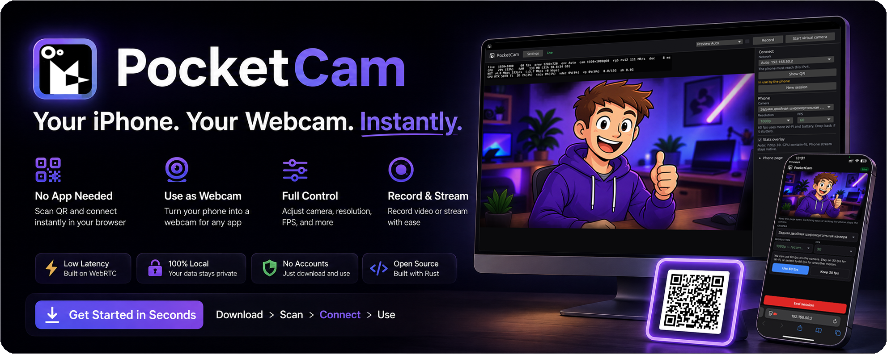
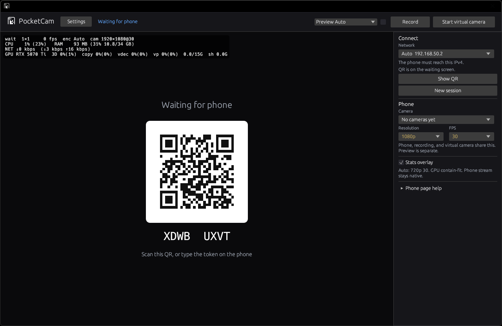
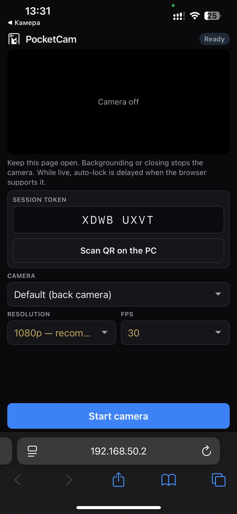
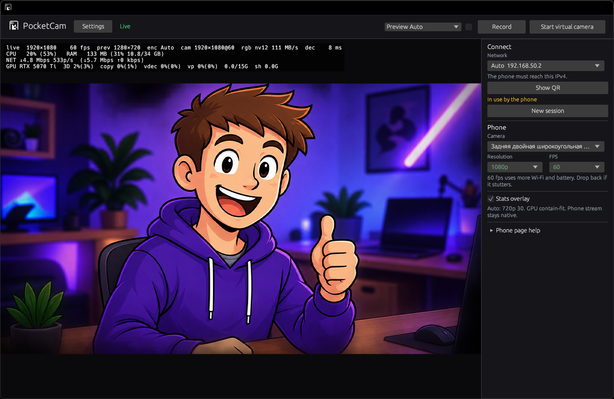
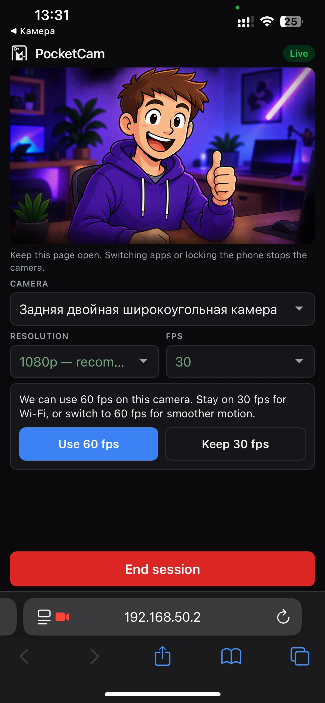

<p align="center">
  
</p>

<p align="center">
  <a href="https://github.com/Mapagmataas1331/PocketCam/releases/latest/download/PocketCamSetup.exe">
    
  </a>
</p>

<p align="center">
  <sub>
    Installer from the
    <a href="https://github.com/Mapagmataas1331/PocketCam/releases/latest">latest GitHub Release</a>.
    Unsigned builds may show SmartScreen — More info, then Run anyway.
  </sub>
</p>

#  PocketCam

**Your phone is a Windows webcam.** Nothing to install on the phone.

Open PocketCam, scan the QR with Safari or Chrome, allow the camera, keep the page open. Same Wi-Fi. No accounts, no cloud, no cable. OBS, Discord, Zoom, Teams, and the Windows Camera app see a camera named **PocketCam**.

```text
Phone browser  →  your PC  →  any app that can pick a webcam
```

## Screens

<table>
  <tr>
    <td align="center" width="68%">
      
      <br><sub>Windows — scan the QR</sub>
    </td>
    <td align="center" width="32%">
      
      <br><sub>Phone — Start camera</sub>
    </td>
  </tr>
  <tr>
    <td align="center">
      
      <br><sub>Windows — live</sub>
    </td>
    <td align="center">
      
      <br><sub>Phone — live</sub>
    </td>
  </tr>
</table>

## Why PocketCam

- **Zero install on the phone.** Safari on iPhone, Chrome on Android. A Home Screen shortcut is optional; it is still the browser.
- **Your LAN only.** The stream never leaves the Wi-Fi (or phone hotspot) you are on. Google STUN is off unless you turn it on in Settings.
- **A real Windows camera.** Other apps do not need a PocketCam plugin.
- **The quality you pick.** 480p through 4K, up to 60 fps. Default is 1080p30.
- **Record the original stream.** PocketCam saves the phone’s H.264, not a second encode.
- **Stay in the tray.** Close the window; the camera keeps running until you Exit.

Keep the phone page open. Phones stop the camera when that page is gone — that is iOS and Android, not PocketCam. While you are live, the page holds a Screen Wake Lock so auto-lock does not kill the session.

## Install (Windows 11)

1. [Download the installer](https://github.com/Mapagmataas1331/PocketCam/releases/latest/download/PocketCamSetup.exe) from the latest GitHub Release. It places the app in Program Files, registers the virtual camera, and adds a Windows Firewall rule for a private network. Unsigned builds may show SmartScreen — More info, then Run anyway. Developers building from source can skip Setup and run `scripts\register-camera.ps1` once, elevated.
2. Open **PocketCam** from the Start menu.
3. On your phone, scan the QR (Safari or Chrome).
4. Continue past the certificate warning — it is expected. PocketCam uses a certificate for *this PC*, not a public website.
5. Tap **Start camera** and allow access. Keep that page in the foreground.
6. In OBS, Discord, Zoom, Teams, or Windows Camera, choose **PocketCam**.

Need the picture again after changing 720p ↔ 1080p ↔ 4K? Pick PocketCam once more in that app. You do not need to restart OBS.

## Use

| Control | What it does |
|---|---|
| **Quality** | What the phone encodes. Recording and the virtual camera follow this. Resolution and frame rate are separate lists. |
| **Preview** | The picture in the PocketCam window only. Auto turns it off while the virtual camera or a recording is running so the PC can keep up. Check **Keep** if you want the window live anyway. |
| **Virtual camera** | What other Windows apps see. Locked to the Quality size while it is on. |
| **Record** | Saves to Videos\PocketCam (or the folder in Settings). Starts on the next keyframe. |

The waiting screen shows a large QR and a short token. **Show QR** in the side bar is there if you need the URL again, or a new session, while a phone is already connected.

If the phone leaves, the same token works for about five minutes. **New session** mints a new one.

Local preview on the phone pauses after a few seconds idle (the PC still gets the stream). Tap to wake. Portrait into a landscape webcam is rotated, then fit — never stretched.

## Requirements

- Windows 11 PC
- iPhone (Safari) or Android (Chrome) on the **same Wi-Fi**, or the PC on the phone’s hotspot
- H.264. Chrome and Safari send that. Firefox is untested.

## Files PocketCam creates

| Place | Path | What |
|---|---|---|
| Install | `C:\Program Files\PocketCam\` | App and camera driver (`VirtualCameraMediaSource.dll`) |
| Camera | `C:\ProgramData\PocketCam\` | Shared frame buffer (`nv12.ring`) |
| Per-user | `%LOCALAPPDATA%\PocketCam\` | Certificates and `settings.json` |
| Recordings | `%USERPROFILE%\Videos\PocketCam\` | `pocketcam-YYYYMMDD-HHMMSS.mp4` (you can pick another folder) |

The phone stores nothing PocketCam-owned.

---

## For developers

Rust (2021) host: **egui / eframe** UI, **axum** HTTPS, **webrtc-rs**, Windows **Media Foundation** H.264 decode, **Win32** tray and virtual camera. Phone page is plain HTML/JS in `web/` (baked in with `include_str!` — rebuild after edits). QR scanning uses [jsQR](https://github.com/cozmo/jsQR) (Apache-2.0). The camera source in `redist/` is built from Microsoft’s Windows Virtual Camera sample (MIT).

```text
src/                 Windows host
web/                 Phone page
crates/ipc/          NV12 ring the camera driver reads
redist/              VirtualCameraMediaSource.dll
installer/           Inno Setup (PocketCam.iss)
scripts/             Run helpers and elevated camera registration
.github/workflows/   CI, release, GitHub Pages
images/              README banner, logo, screens
pocketcam.svg        App and site icon
THIRD_PARTY.md       jsQR and camera-sample licenses
```

Kill a leftover `pocketcam.exe`, then `cargo run`. Release is the usual path; debug is faster to compile.

```text
scripts\run.bat
scripts\run-debug.bat
```

PowerShell: `scripts\run.ps1` or `scripts\run.ps1 -Debug`. Or `cargo run --release`. Rust stable. Users install `PocketCamSetup.exe` from Releases (`installer/PocketCam.iss`). For a cargo-run build, register the camera once (elevated):

```text
scripts\register-camera.ps1
```

Phone HTML/JS changes need a rebuild. Do not write next to the exe, into Temp, or into Documents root.

---

## Later

v1 is this Windows 11 app: one phone, no virtual mic, self-signed cert.

### v2

| Item | What | Why not v1 |
|---|---|---|
| **Multiple phones** | One Windows camera per extra phone (slots). | Safari cannot run two cameras on one iPhone. Extra ring, token, and Frame Server instance per slot. |
| **Virtual microphone** | Phone Opus → a Windows mic Discord / OBS can select. | No Frame Server for mics. Needs a signed audio driver. Playback in the PocketCam window is not this. |
| **Windows 10** | Same app on Windows 10 if people ask. | After multiple phones and virtual mic. v1 stays Win11. |

### Not planned

Revisit only if a real user is stuck.

| Idea | Why not |
|---|---|
| **Easy Connect** (skip the Safari cert warning) | Ugly cert onboarding is allowed. Only if people cannot connect. |
| **USB** phone → PC | iPhone is not UVC. Would need an iOS app. Only if 250 ms fails on 5 GHz. |
| **Native phone app** | Background camera. Breaks nothing-to-install. |
| **TURN / remote** (LTE → home) | Needs a relay. PocketCam is a LAN webcam. |

## License

PocketCam source is not MIT. You may use the official build; you may not redistribute or sell it. See `LICENSE`. Third-party notices (jsQR, Windows Virtual Camera sample) are in `THIRD_PARTY.md`.
